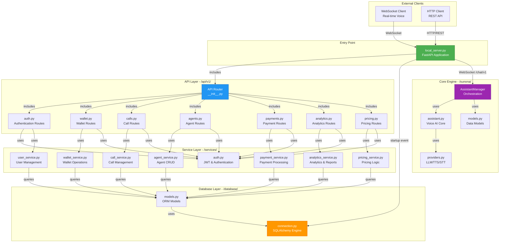
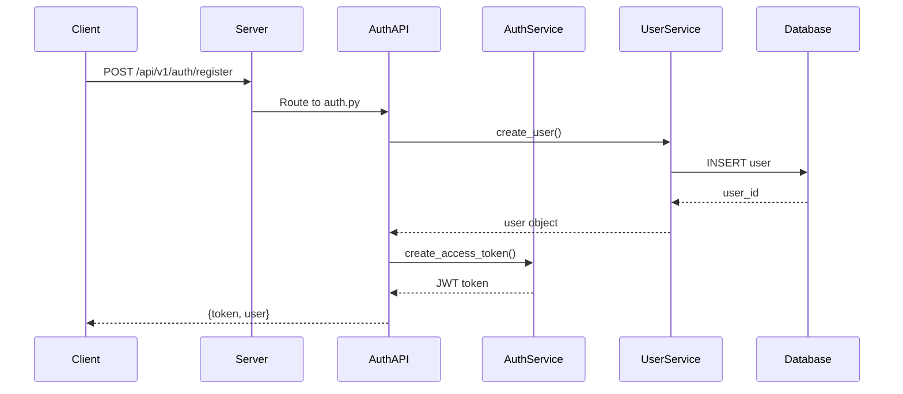
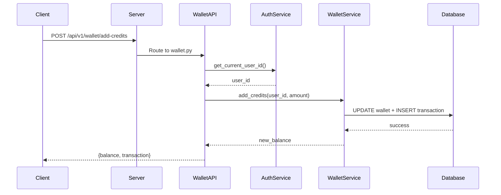
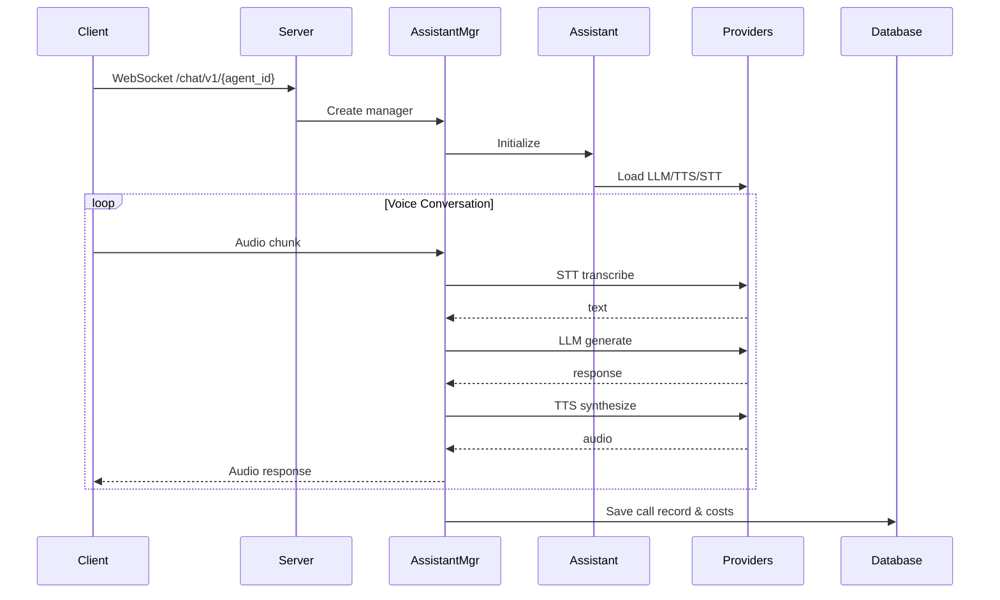
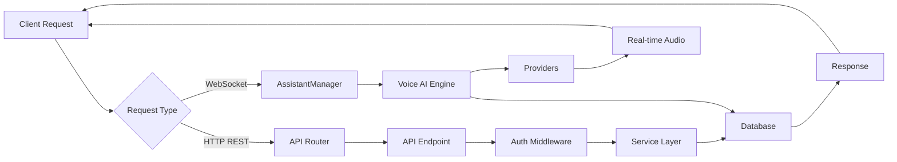

# Backend Architecture - Complete Setup & Flow

## System Architecture Diagram



---

## Request Flow Examples

### 1️⃣ **Authentication Flow**



### 2️⃣ **Wallet Transaction Flow**



### 3️⃣ **Voice Call Flow (WebSocket)**



---

## Component Interconnections

### 📁 **Directory Structure & Dependencies**

````carousel
### Entry Point
**File:** `local_setup/local_server.py`

**Imports:**
```python
from database.connection import init_db
from api.v1 import api_router
from sunona.agent_manager.assistant_manager import AssistantManager
```

**Responsibilities:**
- FastAPI app initialization
- CORS middleware
- Database startup
- API router inclusion
- WebSocket endpoint
- Legacy MockRedis endpoints

<!-- slide -->

### API Layer
**Directory:** `api/v1/`

**Files & Routes:**
- `auth.py` → `/api/v1/auth/*`
- `wallet.py` → `/api/v1/wallet/*`
- `calls.py` → `/api/v1/calls/*`
- `agents.py` → `/api/v1/agents/*`
- `payments.py` → `/api/v1/payments/*`
- `analytics.py` → `/api/v1/analytics/*`
- `pricing.py` → `/api/v1/pricing/*`

**Common Pattern:**
```python
from services.auth import get_current_user_id
from services.{module}_service import {module}_service
```

<!-- slide -->

### Service Layer
**Directory:** `services/`

**Files:**
- `auth.py` - JWT token creation/validation
- `user_service.py` - User CRUD operations
- `wallet_service.py` - Wallet & transactions
- `call_service.py` - Call records & tracking
- `agent_service.py` - Agent management
- `payment_service.py` - Payment processing
- `analytics_service.py` - Analytics & reports
- `pricing_service.py` - Cost calculations

**Common Pattern:**
```python
from database.models import User, Wallet, Call, etc.
from database.connection import SessionLocal
```

<!-- slide -->

### Database Layer
**Directory:** `database/`

**Files:**
- `connection.py` - SQLAlchemy engine & session
- `models.py` - ORM models (User, Wallet, Call, Agent, etc.)

**Models:**
```python
User, Wallet, WalletTransaction, Call, 
Agent, Payment, PricingConfig
```

**Connection:**
```python
engine = create_engine(DATABASE_URL)
SessionLocal = sessionmaker(bind=engine)
Base = declarative_base()
```

<!-- slide -->

### Voice AI Engine
**Directory:** `sunona/`

**Key Files:**
- `assistant.py` - Core voice AI logic
- `models.py` - Pydantic models
- `providers.py` - LLM/TTS/STT providers
- `agent_manager/assistant_manager.py` - Orchestration

**Integration:**
- Used by WebSocket endpoint
- Handles real-time voice conversations
- Tracks usage for billing
````

---

## Data Flow Summary

### 🔄 **Complete Request Lifecycle**



### 🔐 **Authentication Flow**

1. **Client** sends credentials
2. **AuthAPI** receives request
3. **UserService** validates against **Database**
4. **AuthService** generates JWT token
5. Token returned to **Client**
6. Subsequent requests include token in header
7. **AuthService** validates token via `get_current_user_id()`

### 💰 **Wallet & Billing Flow**

1. **Client** requests wallet operation
2. **WalletAPI** authenticates user
3. **WalletService** performs transaction
4. **Database** updates wallet & creates transaction record
5. **PricingService** calculates costs
6. Balance returned to **Client**

### 📞 **Voice Call Flow**

1. **Client** connects via WebSocket
2. **Server** creates **AssistantManager**
3. **AssistantManager** loads agent config
4. **Voice AI Engine** processes audio
5. **Providers** handle STT/LLM/TTS
6. **CallService** tracks usage & costs
7. Real-time audio streamed to **Client**

---

## Key Integration Points

| Component | Depends On | Used By |
|-----------|------------|---------|
| **local_server.py** | api.v1, database, sunona | All clients |
| **api/v1/** | services | local_server.py |
| **services/** | database.models | api/v1/ |
| **database/** | - | services/, sunona/ |
| **sunona/** | database (optional) | local_server.py |

---

## Technology Stack

- **Framework:** FastAPI
- **Database:** SQLAlchemy ORM
- **Authentication:** JWT (python-jose)
- **Real-time:** WebSocket
- **Voice AI:** Sunona Engine (LLM/TTS/STT)
- **Server:** Uvicorn ASGI
